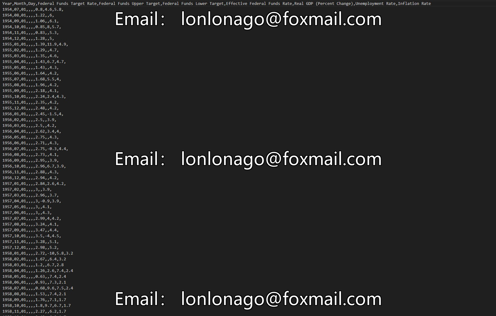

## Body

Federal Reserve Rates (1954-2017)

The Federal Reserve sets interest rates to create an environment conducive to achieving the goals set by Congress—high employment, low and stable inflation, sustainable economic growth, and moderate long-term interest rates. The interest rates set by the Federal Reserve directly affect borrowing costs. Lower interest rates encourage more people to apply for mortgage loans or use funds for purchasing cars, renovating homes, etc. Lower interest rates also encourage businesses to borrow funds for expansion, such as purchasing new equipment, updating factories, or hiring more employees. Higher interest rates can suppress consumer and business borrowing behavior in this regard.

This dataset covers monthly economic conditions since 1954. The federal funds rate refers to the overnight lending rate used by depository institutions (balances held at the Federal Reserve Banks) during federal funds transactions. The interest rate paid by borrowing institutions to loan institutions is negotiated between two banks; the weighted average of all such negotiations is known as the effective federal funds rate. The effective federal funds rate is determined by the market but is influenced by the Federal Open Market Committee (FOMC) through open market operations to achieve the target federal funds rate. The FOMC meets eight times a year to determine the target federal funds rate; this target was converted to a range with upper and lower limits in December 2008. Real Gross Domestic Product is based on seasonally adjusted quarterly GDP growth rates calculated using constant prices in 2009. Unemployment rates represent the seasonal adjustment percentage of the number of unemployed relative to the labor force. Inflation rates reflect the monthly change in the Consumer Price Index excluding food and energy.

## Images

Here is a pay link on Stripe ( https://buy.stripe.com/3cs8yP7sY87d0vu9AB ). Please contact me lonlonago@foxmail.com after funding $89, and I will send you a complete data files , thank you!

